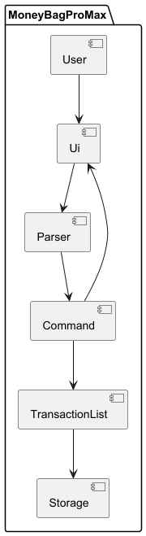
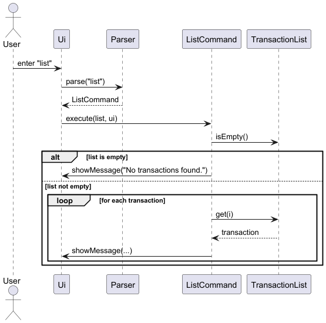
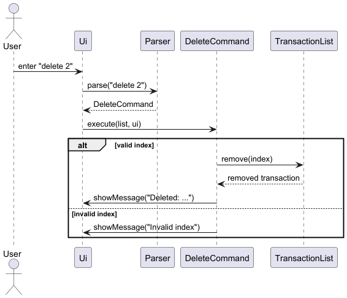

# Developer Guide

## Acknowledgements

{list here sources of all reused/adapted ideas, code, documentation, and third-party libraries -- include links to the original source as well}

## Design & implementation

# Design

## Architecture

(Overall system architecture diagram and explanation)

## Components
### Parser
### Command
### Ui
### TransactionList / Storage
# Implementation

## List and Delete Transaction Feature

### Overview
The list and delete transaction features allow users to manage their transactions stored in the application.
The `list` command displays all recorded transactions in a numbered format, while the `delete` command removes a transaction based on its index.
These features improve usability by allowing users to review and remove transactions easily.

### Architecture and Flow
When a user enters a command, the input is first handled by the `Ui` component, which reads the input and passes it to the `Parser`.
The `Parser` then interprets the input and creates the appropriate `Command` object (`ListCommand` or `DeleteCommand`).
The command is executed using the `TransactionList` to retrieve or remove transactions, and the result is displayed to the user through the `Ui`.

### Sequence Diagram for List Command

### Listing Transactions
The `list` command is implemented using the `ListCommand` class.
When executed, the command checks whether the transaction list is empty using the `isEmpty()` method.
If the list is not empty, it iterates through the transactions using the `size()` and `get(int i)` methods and displays them in a numbered format.

### Sequence Diagram for Delete Command

### Deleting Transactions
The `delete` command is implemented using the `DeleteCommand` class.
The `Parser` extracts the index provided by the user and passes it to the `DeleteCommand`.
The `DeleteCommand` then removes the corresponding transaction from `TransactionList` using the `remove(int i)` method and displays a confirmation message.

### Class Diagram

### Design Considerations
This feature uses a command-based architecture to ensure separation of concerns.
The `Parser` is responsible only for parsing user input, while each command class is responsible for executing its own logic.
The `TransactionList` class manages the storage of transactions, which improves modularity and maintainability.
Assertions and logging are used in `TransactionList` as part of defensive programming to detect invalid operations and to record important actions such as adding or removing transactions.

### Alternatives Considered
One alternative was to place all command logic inside the `Parser` class using conditional statements.
However, this approach would make the `Parser` class too large and difficult to maintain as more commands are added.
Another alternative was to allow the `Ui` class to directly modify the transaction list, but this would reduce modularity and violate separation of concerns.
The chosen design using separate command classes was preferred because it improves extensibility and maintainability.

### Future Improvements
Possible future improvements include allowing deletion of multiple transactions at once, supporting filtered list views, and adding an undo feature to restore deleted transactions

## Product scope
### Target user profile

{Describe the target user profile}

### Value proposition

{Describe the value proposition: what problem does it solve?}

## User Stories

|Version| As a ... | I want to ... | So that I can ...|
|--------|----------|---------------|------------------|
|v1.0|new user|see usage instructions|refer to them when I forget how to use the application|
|v2.0|user|find a to-do item by name|locate a to-do without having to go through the entire list|

## Non-Functional Requirements

{Give non-functional requirements}

## Glossary

* *glossary item* - Definition

## Instructions for manual testing

{Give instructions on how to do a manual product testing e.g., how to load sample data to be used for testing}
