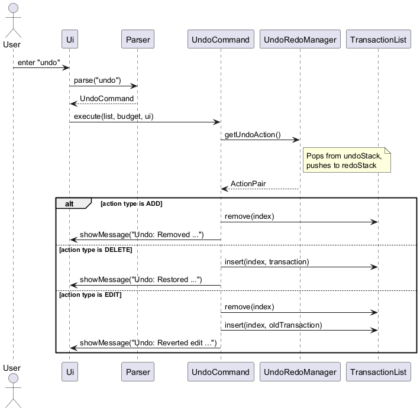
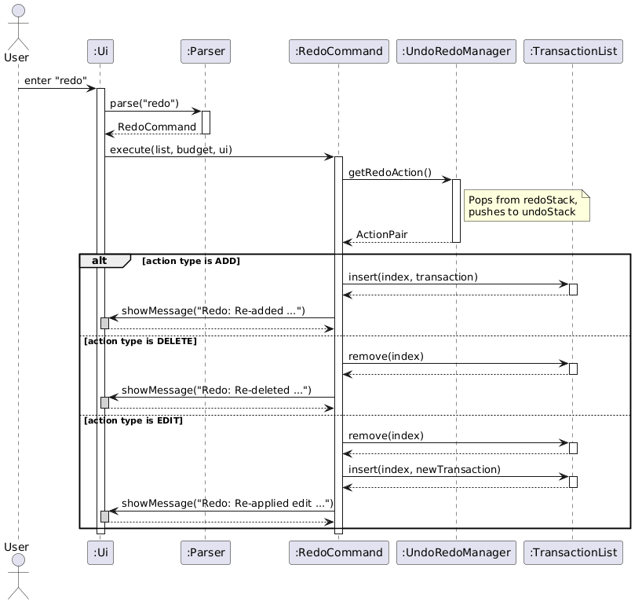
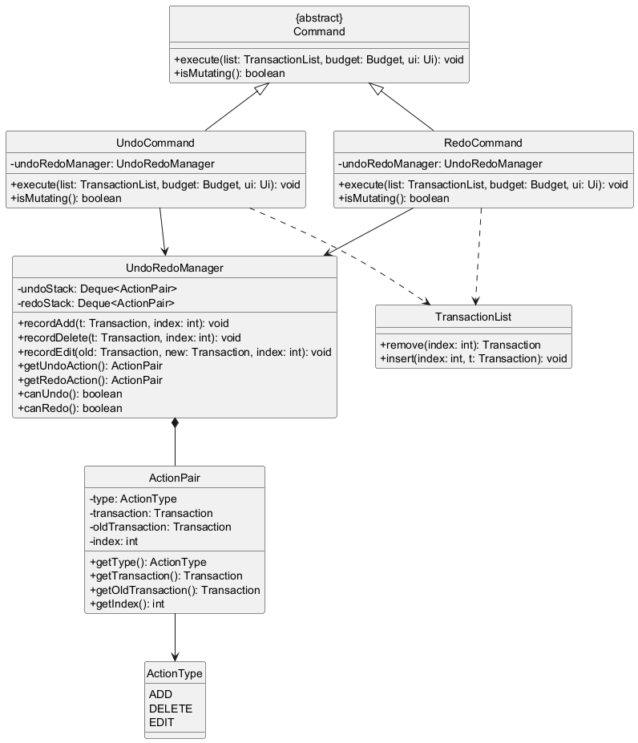

# Jason Chen's Project Portfolio Page

## Project: MoneyBagProMax

MoneyBagProMax is a command-line personal finance management application designed to help users track
income and expenses, manage budgets, and gain insights into spending habits through financial statistics.
The user interacts with it using a CLI, and the application is written in Java.

Given below are my contributions to the project.

---

## Summary of Contributions

### New Feature: Sort Command
**What it does:**
Allows users to sort and display their transactions by date (ascending), amount (descending), or category (alphabetical). The original list order is preserved — the sort is non-mutating and operates on a defensive copy.

**Justification:**
Users accumulate transactions over time in no particular order. Being able to sort by date or amount lets users quickly spot their largest expenses or review a chronological spending history without having to scroll through an unsorted list.

**Highlights:**
The comparator is resolved at execution time using a switch on the sort criteria string, keeping the logic self-contained in `SortCommand`. Because the original `TransactionList` is never reordered, other commands that depend on insertion-order indices (e.g. `delete`, `edit`) are unaffected.

---

### New Feature: Undo/Redo
**What it does:**
Allows users to undo the most recent mutating command (add, delete, edit) and redo it if they change their mind. Multiple sequential undos and redos are supported.

**Justification:**
Accidental deletions or edits are a common user error in any data-entry application. Without undo, the only recovery path is re-entering the data manually. This feature significantly reduces the risk of data loss from slip-of-the-finger mistakes.

**Highlights:**
Implemented using a dual-stack design in `UndoRedoManager`. Each mutating command records an `ActionPair` (action type, transaction, index) onto the undo stack at execution time. Performing any new mutating command clears the redo stack, which is the standard correct behaviour — it prevents redo from replaying actions that have been superseded. The `EDIT` action type stores both the old and new transaction so the original state can be restored exactly.

---

### New Feature: Recurring Transactions
**What it does:**
Allows users to define recurring transaction templates (e.g. a monthly salary or a weekly grocery expense) that can be automatically generated as real transactions on demand. Users can add, list, delete, and trigger generation of recurring entries.

**Justification:**
Many real-world income and expense entries repeat on a fixed schedule. Without this feature, users must re-enter identical transactions every month. Recurring transactions reduce repetitive data entry and make the application more practical for everyday personal finance use.

**Highlights:**
`RecurringTransaction` is deliberately *not* a subclass of `Transaction` — it is a template that stores a frequency, start date, and last-generated date, and is only resolved into concrete `Transaction` objects when `GenerateRecurringCommand` is executed. This separation keeps the template model clean and avoids polluting the main transaction list with non-transactional metadata. The transaction type (income vs expense) is inferred automatically from the category at construction time, reusing `Income.VALID_CATEGORIES`.

---

### New Feature: Transaction Date and Description Fields
**What it does:**
Extended the `Transaction` class with an optional `LocalDate` date field (defaults to today if omitted) and an optional free-text description field. Both fields are parsed from the `d/` and `desc/` tokens in user input.

**Justification:**
Without a date field, all transactions are implicitly "today", making it impossible to backfill historical entries. The description field gives users a way to annotate transactions (e.g. "monthly pay", "dinner with team") for easier recall later.

**Highlights:**
Both fields are optional at the parser level — existing commands continue to work without them. The date field is used as the sort key in `SortCommand` and as a filter criterion in `FilterCommand`, making it a foundational addition that multiple other features depend on.

---

### Enhancements Implemented:
- Added `assert` statements to `Transaction`, `Income`, `Expense`, `UndoRedoManager`, and `RecurringTransaction` constructors and `execute()` methods to catch violated preconditions early.
- Added Javadoc to all authored classes and methods.
- Wrote JUnit tests for `SortCommand`, `UndoRedoManager` (add/delete/edit undo and redo), `RecurringTransaction` (construction, type inference, generation logic), and `Transaction` enhancements (date and description fields).

---

### Code Contributed
[Jason's RepoSense](https://nus-cs2113-ay2526-s2.github.io/tp-dashboard/?search=Nishuy52&breakdown=true)

---

### Contributions to the User Guide
I contributed the following sections to the User Guide:
- Sort command
- Undo command
- Redo command
- Add recurring transaction command
- Delete recurring transaction command
- List recurring transactions command
- Generate recurring transactions command

Each section includes the command format, examples, and explanations.

---

### Contributions to the Developer Guide
I contributed the following sections to the Developer Guide:

**Sort Transaction Feature**
- Architecture and flow (Parser → `parseSortCommand()` → `SortCommand` → `getSortedList()`)
- Implementation details: comparator selection switch, non-mutating defensive-copy design, `isMutating()` returning false
- Design considerations: why non-mutating sort preserves undo/redo index correctness, use of Java standard-library comparators
- Alternatives considered: in-place sort with "unsort", caching sorted results, persistent sort order
- Future improvements
- Sort Sequence Diagram (`SortSequenceDiagram.png`)
- Sort Class Diagram (`SortClassDiagram.png`)

**Undo and Redo Feature**
- Architecture and flow: `UndoRedoManager` instantiation, injection into `Parser`, dual-stack lifecycle
- Implementation details: `ActionPair` inner class fields, undo logic (inverse operations per `ActionType`), redo logic (reapply original action), `isMutating()` returning true
- Design considerations: dual-stack delta vs. Memento pattern (O(1) vs. O(n) memory), clearing redo stack on new action, index-based reinsertion correctness, non-persistent history rationale
- Alternatives considered: Memento pattern, per-command `undo()` methods, single list with index pointer
- Future improvements
- Undo Sequence Diagram (`UndoSequenceDiagram.png`)
- Redo Sequence Diagram (`RedoSequenceDiagram.png`)
- Undo/Redo Class Diagram (`UndoRedoClassDiagram.png`)

**Recurring Transactions Feature**
- Full feature section: architecture and flow, model design (`RecurringTransaction`, `Frequency` enum, `RecurringTransactionList`), all four command implementations (`AddRecurringCommand`, `ListRecurringCommand`, `DeleteRecurringCommand`, `GenerateRecurringCommand`)
- `isMutatingRecurring()` contract and separate save flag design
- Storage persistence: `[REC]` pipe-delimited format, atomic temp-file write strategy, `loadRecurring()`/`saveRecurring()` flow
- Auto-generation on startup design
- Design considerations: template separate from `Transaction` hierarchy, watermark-based generation, separate save flag
- Alternatives considered and future improvements

**Transaction Class**
- `Transaction` abstract class overview, field table (`category`, `amount`, `description`, `date`), `protected final` immutability rationale, `getType()` abstract method description

---

### Contributions to Team-Based Tasks
- Set up the About Us page (`jason-AboutUs` branch).
- Reviewed pull requests and provided feedback on code quality and documentation.
- Actively managed the team's GitHub Issues board and assigned issues to relevant team members.
- Fixed checkstyle issues and improved code quality.
- Performed manual testing and text-ui testing.

---

### Review / Mentoring Contributions
- Reviewed teammates' pull requests and suggested improvements to code correctness and documentation.

---

### Beyond-Team Contributions
- Reported 22 bugs during the Practical Exam (Dry Run) for another team's product.

---

### Tools Used
- Gradle for build automation
- JUnit for unit testing
- Checkstyle for code quality
- GitHub for version control and pull request management

---

## Contributions to the User Guide — Extract

The following is an extract from the User Guide for the Sort command, one of the sections I authored.

---

### Sorting Transactions: `sort`
Displays transactions sorted by the specified criterion. The underlying list order is **not changed** — this is a display-only operation.

**Format**: `sort by/CRITERIA`

**Valid criteria:**
- `date` — ascending (earliest first)
- `amount` — descending (largest first)
- `category` — alphabetical A–Z (case-insensitive)

**Examples**:
- `sort by/date` — shows all transactions from earliest to latest.
- `sort by/amount` — shows all transactions from highest to lowest amount.
- `sort by/category` — shows all transactions sorted alphabetically by category.

> [!NOTE]
> Sort does not change the indices used by `delete` and `edit`. Use `list` to see the original insertion order.

---

## Contributions to the Developer Guide — Extract

The following is an extract from the Developer Guide for the Undo and Redo feature, one of the sections I authored.

---

## Undo and Redo Feature

### Overview
The `undo` and `redo` commands allow users to reverse and reapply the last mutating operation
(add, delete, or edit). They provide a safety net against accidental changes. The feature uses
a dual-stack pattern: an undo stack records performed actions and a redo stack records undone
actions, enabling bidirectional navigation of the action history.

### Architecture and Flow
`UndoRedoManager` is instantiated once in `MoneyBagProMax` (the main class) and injected into
the `Parser`. When a mutating command (`AddCommand`, `DeleteCommand`, `EditCommand`) executes,
it calls the appropriate `record*()` method on `UndoRedoManager`, which pushes an `ActionPair`
onto the undo stack and clears the redo stack. When the user types `undo`, the `Parser` creates
an `UndoCommand` that holds a reference to the shared `UndoRedoManager`. During execution,
`UndoCommand` pops the top action from the undo stack, pushes it onto the redo stack, and applies
the inverse operation to `TransactionList`. `redo` works symmetrically.

### Sequence Diagram for Undo Command
The following diagram shows the full interaction when a user undoes a previous action.

### Sequence Diagram for Redo Command
The following diagram shows the full interaction when a user redoes a previously undone action.

### Implementation Details
- **Recording actions:** Each mutating command calls `recordAdd()`, `recordDelete()`, or
  `recordEdit()` on `UndoRedoManager` after modifying the list. Each method creates an
  `ActionPair` capturing the action type, the affected transaction(s), and the list index,
  then clears the redo stack to invalidate any future redo history.
- **ActionPair:** An inner static class of `UndoRedoManager` that stores:
  - `ActionType`: enum (`ADD`, `DELETE`, `EDIT`)
  - `transaction`: the transaction that was added/deleted, or the new version after an edit
  - `oldTransaction`: the previous version before an edit (null for ADD and DELETE)
  - `index`: the position in the list at the time the action was performed
- **Undo logic:** `UndoCommand.execute()` calls `getUndoAction()`, which pops from the undo
  stack and pushes onto the redo stack. The command then switches on the action type to perform
  the inverse operation:
  - `ADD` → `list.remove(index)` (removes the added transaction)
  - `DELETE` → `list.insert(index, transaction)` (re-inserts the deleted transaction)
  - `EDIT` → `list.remove(index)` then `list.insert(index, oldTransaction)` (restores
    the pre-edit version)
- **Redo logic:** `RedoCommand.execute()` calls `getRedoAction()`, which pops from the redo
  stack and pushes onto the undo stack. The command then reapplies the original action:
  - `ADD` → `list.insert(index, transaction)`
  - `DELETE` → `list.remove(index)`
  - `EDIT` → `list.remove(index)` then `list.insert(index, transaction)`
- **Mutating flag:** Both `UndoCommand` and `RedoCommand` override `isMutating()` to return
  `true`, which triggers auto-save to storage after execution.

### Class Diagram

### Design Considerations
- **Dual-stack delta vs. Memento pattern:** The Memento pattern stores a complete copy of the
  entire `TransactionList` before each mutating action. While straightforward, this uses O(n)
  memory per recorded action, where n is the list size. The dual-stack approach stores only the
  delta, the action type, one or two transaction objects, and an index, using O(1) memory per
  action. For a personal finance app where sessions may involve many operations, the delta approach
  is more memory-efficient.
- **Clearing the redo stack on new action:** When a new mutating action occurs after one or more
  undoes, the redo stack is cleared. This follows the standard undo/redo contract used by text
  editors: branching redo history (where redo could replay an action conflicting with newer
  changes) is avoided by discarding the redo stack. The result is a linear, predictable history.
- **Index-based reinsertion:** Storing the exact list index allows transactions to be restored to
  their original position. This is correct because undo/redo is strictly LIFO, the most recent
  action must be undone before earlier ones, which guarantees that stored indices remain valid
  during sequential undo/redo sequences.
- **Non-persistent history:** Undo/redo stacks are in-memory only and cleared on application
  exit. Persisting them would require serializing `ActionPair` objects across sessions, with
  the risk of stale references if the saved data file is modified externally. For a CLI app,
  this complexity is disproportionate to the benefit.

### Alternatives Considered
- **Memento pattern (full state snapshots):** Store a complete copy of `TransactionList` before
  each mutating action and restore the snapshot on undo. Advantage: simpler undo logic (just
  swap the reference). Disadvantage: O(n) memory per action, and deep-copying `Transaction`
  objects for every add/delete/edit is costly. Rejected due to memory overhead.
- **Command pattern with per-command undo methods:** Add an `undo()` method to each command
  class (e.g., `AddCommand.undo()` removes the added transaction). This couples undo logic
  directly to each command class, spreading the responsibility across many files and making
  it harder to add new commands. The chosen design centralises all undo/redo logic in
  `UndoRedoManager` and two command classes.
- **Single list with an index pointer:** Maintain one list of `ActionPair` objects with a
  pointer that moves backward on undo and forward on redo. This is functionally equivalent to
  the dual-stack approach but is less intuitive conceptually, the dual-stack model maps more
  directly to the standard mental model of "undo history" and "redo history" as separate queues.

### Future Improvements
- Set a maximum undo history size (e.g., 50 actions) to bound memory usage in long sessions.
- Persist undo/redo history to a separate file so it survives application restarts.
- Add `undo N` syntax to undo multiple actions in a single command.
- Add a `history` command to list available undo/redo operations so users can see what actions
  are available before committing to an undo.
